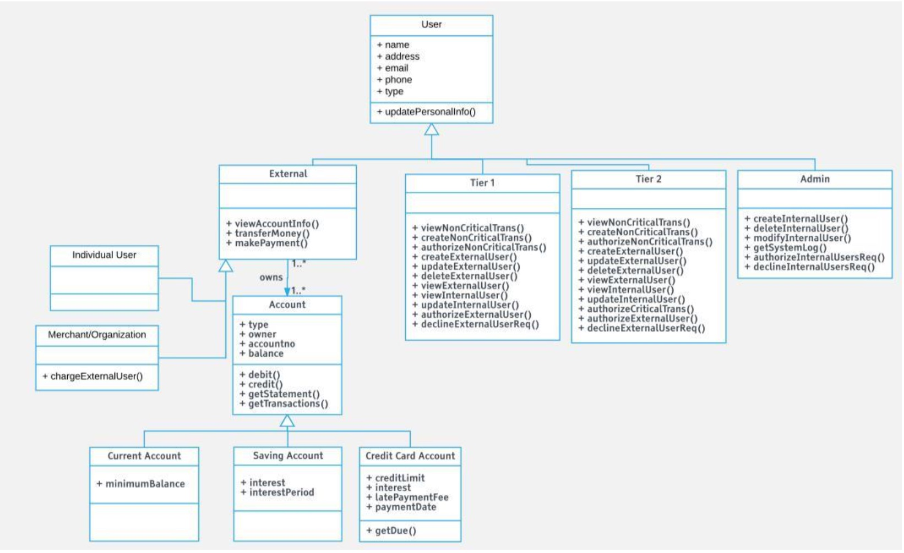

# Secure Bank System

<h2>Setup</h2>

1. Install Virtual Box
   https://www.virtualbox.org/wiki/Downloads

2. Install Vagrant
    https://www.vagrantup.com/downloads.html

3. Run These commands from your terminal, inside the project directory
```
vagrant up
```

4. After vagrant up completes, you will be able to connect to your locally running MongoDB with this IP Adress: 192.168.33.10, Default port. You can use this tool if you like: https://robomongo.org/

<h2>System Information</h2>
1. OS: ubuntu 16.04
2. Http Server: Nginx, Tomcat
3. Frontend Framework: Angular1
4. Backend Framework: Spring
5. Database: MongoDB

<h2>Banking Functions</h2>
Just same as the BOA, Chase…etc. web bank applications. We have different types of account and credit card functions. With the complete transaction functions to transfer money and check the history.</br>
1. Account function part: Three types of account, checking, saving and credit. Allow transferring money between owned accounts or others user’s accounts.</br>
2. Transaction function part: Sent through the email or account ID to achieve the transaction function. Make the payment to merchants. And layout the transaction history into document.</br>
3. Other function part: PII.</br>
<h2>Security Features</h2>
1. PKI: Server side SSL with self-signed cert, PKCS12 implementation.</br>  
2. OTP: Timed-Based password validation to the server side session.</br>  
3. Malicious login control: Strict password requirements, OTP timeout.</br>
4. Trust management: Handled by SSL and an application authenticated session.</br>  
5. Session management: Session handle is generated by basic auth credential and OTP.</br>  
6. Email alert: Using Gmail SMTP with Java mail api in OTP, account create and critical transaction.</br>  
7. Hash password and sensitive data: Implemented MD5 hash algorithm.</br>  
8. 24/7 User access: Apache Tomcat as our application container. Apache Tomcat software powers numerous large-scale, mission-critical web applications across a diverse range of  industries and organizations.</br>  
9. Multi users simultaneous access: Apache Tomcat handles thread pooling and a distributed deployment with no code changes.</br>  
10. Software testing: Do the unit test, integrated test and system test. Also with malicious attack testing like Broken Authentication, XSS, SQL injection and Man in the Middle attack</br> 

<h2>Class Diagram</h2></br>
</img>
